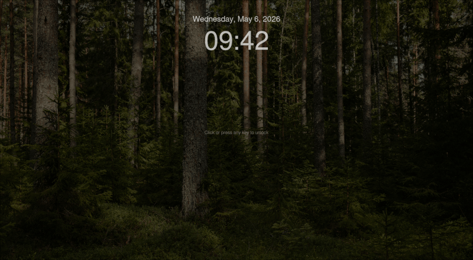

# Quicklock



A simple lock screen for Wayland, built with [Quickshell](https://github.com/quickshell-mirror/quickshell).

## What it does

Locks your session and displays a simple clock with date as a lockscreen. 
Supports both fingerprint readers and password fallback via PAM.

## Usage


```
git clone https://github.com/FLchs/quicklock.git .config/quickshell/quicklock
qs -c quicklock
```

## Requirements

- A Wayland compositor that supports the ext-session-lock protocol
- Quickshell installed and working
- PAM configured on your system

## Security disclaimer

Consider this alpha software. There may be bugs, and it has not been thoroughly audited. It relies on your Wayland compositor to enforce the session lock. If the compositor does not properly implement the ext-session-lock protocol, the screen may not be fully secured. Always verify that your compositor handles session locking correctly before relying on this in sensitive environments.

## Configuration

PAM config lives in the `pam/` directory. The default config uses `password.conf`. Adjust to your system as needed.

Replace `background.jpg` with your own wallpaper if you like.

## Development

Run `qs -p ./test.qml` to preview the lock screen in a floating window without actually locking your session. Useful for tweaking the UI.

## Credits

Base code adapted from the [Quickshell examples repository](https://github.com/quickshell-mirror/quickshell-examples).

Background photo by Lauri Poldre, sourced from [Pexels](https://www.pexels.com/photo/lush-coniferous-forest-with-tall-evergreen-trees-30197098/).

